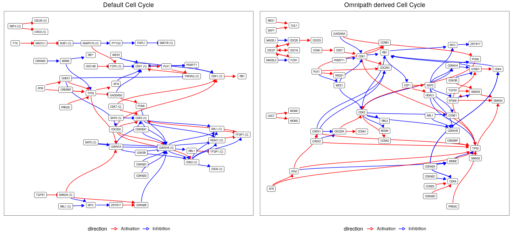

Omnipath to hipathia
================
Martin Garrido Rodriguez-Cordoba
2020-06-09

## Abstract

The main goal of this parser is to transform an
[Omnipath](http://omnipathdb.org/) formatted set of interactions into an
object usable by the mechanistic modelling tool
[hipathia](http://hipathia.babelomics.org/). Hipathia uses a signal
propagation algorithm to estimate the activity of receptor-to-effector
signaling circuits. Its current version uses a pathway-centric approach
fed by a mixture of context-specific and generic signaling pathways as
defined by the [KEGG
classification](https://www.genome.jp/kegg/pathway.html). On the other
hand, Omnipath is a meta-resource that contains biological information
from different databases in a ready-to-use tabular format. It comprises
several types of relationships between biological entities as
protein-protein interactions or TF-target relationships, as well as gene
and protein functional annotations.

The possible parser features derive from the curated information on
Omnipath. Some examples:

1.  Restrict to interactions from certain resources (i.e Reactome,
    BioGRID… etc).

2.  Use the curation effort to create a range of results depending on
    the network reliability.

3.  Expand the effector nodes to new effectors, using Kinase-Substrate
    or TF-target interactions.

4.  Create a meta graph without filtering nodes by biological context.

**Disclaimer**: This repository includes the neccesary functions to
perform the conversion of Omnipath interactions into hipathia MGI
objects. **The creation of the MGI object takes a really long time on
complex graphs**, specially when there are lots of edges between nodes
which are not receptors nor effectors.

## Packages and functions

Load required packages

``` r
# main packages
library(OmnipathR)
library(hipathia)
# annotation package to translate symbols into entrezs
library(org.Hs.eg.db)
# packages to handle and plot graphs
library(igraph)
library(ggplot2)
library(ggraph)
library(Rgraphviz)
library(cowplot)
library(ggVennDiagram)
# other packages from tidyverse
library(dplyr)
library(purrr)
library(tidyr)
library(tibble)
# custom parsing and plotting funs
source("R/omnipath-to-hipathia.R")
source("R/visualize-hipathia-graph.R")
# set ggplot default theme
theme_set(theme_bw() + theme(plot.title = element_text(hjust = 0.5)))
```

## Prepare Omnipath interactions

Import all Omnipath interactions with `import_Omnipath_Interactions()`,
which contains only interactions with references. Subset such
interactions to consensus stimulation or inhibition and discard
auto-interactions. The **curation\_effort** attribute contains the the
number of unique resource+reference pairs per interaction.

``` r
interactions <- OmnipathR::import_Omnipath_Interactions()
```

    ## Downloaded 36684 interactions

    ## removed 0 interactions during database filtering.

``` r
# filter only to directed interactions (consensus) and remove self interactions
intInteractions <- subset(interactions, 
                          (consensus_stimulation == 1 & consensus_inhibition == 0) | 
                            (consensus_stimulation == 0 & consensus_inhibition == 1)) %>%
  subset(source_genesymbol != target_genesymbol)
```

Explore number of interactions per resource

``` r
strsplit(intInteractions$sources, ";") %>%
  unlist() %>%
  data.frame(source = .) %>%
  count(source) %>%
  arrange(n) %>%
  mutate(source = factor(source, levels = source)) %>%
  ggplot(aes(x = n, y = source)) +
  geom_bar(stat = "identity")
```

<!-- -->

For this case of use, we will restrict interactions to those included in
Reactome and BioGRID

``` r
selectedSources <- c("Reactome", "BioGRID")
intInteractions <- subset(intInteractions, grepl(pattern = paste0(selectedSources, collapse = "|"), x = sources))
```

## Hipathia default MGI

Hipathia uses a pathway-centric approach, which isolates nodes and
interactions in different biological contexts defined by KEGG. It
decomposes the signaling networks into a meta graph information object
(MGI), which contains the main graph, the decomposed signaling circuits
(in form of [igraph](https://igraph.org/) objects) and the neccesary
metadata to carry out the analysis. For this case of use, we will focus
on the [cell cycle
pathway](https://www.genome.jp/kegg-bin/show_pathway?hsa04110).

``` r
intPathways <- c("Cell Cycle"="hsa04110")
hipathiaMgi <- hipathia::load_pathways(species = "hsa", pathways_list = intPathways)
```

    ## snapshotDate(): 2020-04-27

    ## Loaded 1 pathways

This is the complete network already processed to be used by Hipathia

``` r
beautyHipathiaGraph(hipathiaMgi$pathigraphs$hsa04110$graph)
```

<!-- -->

Some of the decomposed subgraphs (all receptors that reach one
effector)…

``` r
lapply(hipathiaMgi$pathigraphs$hsa04110$effector.subgraphs[1:2], beautyHipathiaGraph)
```

    ## $`P-hsa04110-46`

<!-- -->

    ## 
    ## $`P-hsa04110-96 97`

<!-- -->

## Hipathia nodes, Omnipath interactions

For a first try, we will employ the subset of nodes from the [cell cycle
pathway](https://www.genome.jp/kegg-bin/show_pathway?hsa04110), using
Omnipath interactions to link the nodes. The first step consists on
obtaining the list of genes (nodes) from hipathia:

``` r
intGenes <- V(hipathiaMgi$pathigraphs$hsa04110$graph)$genesList %>%
  unlist() %>%
  mapIds(x = org.Hs.eg.db, keys = ., keytype = "ENTREZID", column = "SYMBOL") %>%
  as.character() %>%
  .[!is.na(.)]
```

    ## 'select()' returned 1:1 mapping between keys and columns

And subset the Omnipath interactions to those which contain a relation
between genes in the pathway **including complexes**.

``` r
sourceIndex <- strsplit(intInteractions$source_genesymbol, "_") %>% 
  sapply(function(x) any(x %in% intGenes))
targetIndex <- strsplit(intInteractions$target_genesymbol, "_") %>% 
  sapply(function(x) any(x %in% intGenes))
# filter to interactions fulfilling the criteria
filteredInteractions <- intInteractions[sourceIndex & targetIndex, ]
```

Once with the selected interactions, we can apply the
**omnipathToHipathia()** function to transform this network into the
hipathia MGI object. This function relies on the hipathia function
**mgi\_from\_sif()**, which creates the MGI object from the sif and
attribute files. The **omnipathToHipathia()** will format the network
and write the files into a temporary location in order to be imported
with hipathia.

``` r
omnipathMgi <- omnipathToHipathia(filteredInteractions)
```

    ## 'select()' returned 1:1 mapping between keys and columns

    ## `summarise()` ungrouping output (override with `.groups` argument)

    ## Parsing a graph with 61 nodes and 88 edges.

    ## Writing on /tmp/Rtmpee236y

    ## Starting hipathia mgi creation from sif...

    ## Loading graphs...

    ## Creating MGI...

    ## Created MGI with 1 pathway(s)

    ## Done!

We can now perform a visual comparison of the networks

``` r
default <- beautyHipathiaGraph(g = hipathiaMgi$pathigraphs$hsa04110$graph) + ggtitle("Default Cell Cycle")
op <- beautyHipathiaGraph(g = omnipathMgi$pathigraphs$hsa00$graph) + ggtitle("Omnipath derived Cell Cycle")
```

    ## Warning in .local(from, to, graph): edges replaced: 'N-hsa00-25|N-hsa00-21'

    ## Warning in .local(from, to, graph): edges replaced: 'N-hsa00-25|N-hsa00-43'

    ## Warning in .local(from, to, graph): edges replaced: 'N-hsa00-25|N-hsa00-20'

``` r
cowplot::plot_grid(default, op)
```

<!-- -->

And explore how many gene-to-gene interactions are shared between both
MGIs

``` r
# create a graph list
graphs <- list(default = hipathiaMgi$pathigraphs$hsa04110$graph, omnipath = omnipathMgi$pathigraphs$hsa00$graph)
# get all possible gene to gene interactions
geneToGene <- lapply(graphs, function(g) {
  dfs <- igraph::as_data_frame(g, what = "both")
  isNull <- sapply(dfs$vertices$genesList, is.null)
  dfs$vertices$genesList[isNull] <- NA
  geneToGene <- tibble(from = dfs$vertices[dfs$edges$from, "genesList"], to = dfs$vertices[dfs$edges$to, "genesList"]) %>%
    tidyr::unnest(from) %>%
    tidyr::unnest(to) %>%
    subset(from != "/" & !is.na(from) & to != "/" & !is.na(to)) %>%
    transmute(id = paste0(from, "-->", to)) %>% 
    pull(id)
  return(geneToGene)
})
# explore overlap between two sets
ggVennDiagram::ggVennDiagram(geneToGene)
```

<!-- -->

The `omnipathMGI` object is now ready to be passed to functions from
**hipathia** such as:

1.  `hipathia()`
2.  `normalize_paths()`
3.  `get_path_names()`

## Session info

``` r
sessionInfo()
```

    ## R version 4.0.1 (2020-06-06)
    ## Platform: x86_64-pc-linux-gnu (64-bit)
    ## Running under: Ubuntu 18.04.4 LTS
    ## 
    ## Matrix products: default
    ## BLAS:   /usr/lib/x86_64-linux-gnu/blas/libblas.so.3.7.1
    ## LAPACK: /usr/lib/x86_64-linux-gnu/lapack/liblapack.so.3.7.1
    ## 
    ## locale:
    ##  [1] LC_CTYPE=en_US.UTF-8       LC_NUMERIC=C              
    ##  [3] LC_TIME=es_ES.UTF-8        LC_COLLATE=en_US.UTF-8    
    ##  [5] LC_MONETARY=es_ES.UTF-8    LC_MESSAGES=en_US.UTF-8   
    ##  [7] LC_PAPER=es_ES.UTF-8       LC_NAME=C                 
    ##  [9] LC_ADDRESS=C               LC_TELEPHONE=C            
    ## [11] LC_MEASUREMENT=es_ES.UTF-8 LC_IDENTIFICATION=C       
    ## 
    ## attached base packages:
    ##  [1] grid      stats4    parallel  stats     graphics  grDevices utils    
    ##  [8] datasets  methods   base     
    ## 
    ## other attached packages:
    ##  [1] tibble_3.0.1                tidyr_1.1.0                
    ##  [3] purrr_0.3.4                 dplyr_1.0.0                
    ##  [5] ggVennDiagram_0.3           cowplot_1.0.0              
    ##  [7] Rgraphviz_2.32.0            graph_1.66.0               
    ##  [9] ggraph_2.0.3                ggplot2_3.3.1              
    ## [11] org.Hs.eg.db_3.11.4         AnnotationDbi_1.50.0       
    ## [13] hipathia_2.4.0              MultiAssayExperiment_1.14.0
    ## [15] SummarizedExperiment_1.18.1 DelayedArray_0.14.0        
    ## [17] matrixStats_0.56.0          Biobase_2.48.0             
    ## [19] GenomicRanges_1.40.0        GenomeInfoDb_1.24.0        
    ## [21] IRanges_2.22.2              S4Vectors_0.26.1           
    ## [23] AnnotationHub_2.20.0        BiocFileCache_1.12.0       
    ## [25] dbplyr_1.4.4                BiocGenerics_0.34.0        
    ## [27] OmnipathR_1.2.0             igraph_1.2.5               
    ## 
    ## loaded via a namespace (and not attached):
    ##  [1] bitops_1.0-6                  sf_0.9-3                     
    ##  [3] bit64_0.9-7                   httr_1.4.1                   
    ##  [5] tools_4.0.1                   R6_2.4.1                     
    ##  [7] KernSmooth_2.23-17            DBI_1.1.0                    
    ##  [9] colorspace_1.4-1              withr_2.2.0                  
    ## [11] tidyselect_1.1.0              gridExtra_2.3                
    ## [13] VennDiagram_1.6.20            bit_1.1-15.2                 
    ## [15] curl_4.3                      compiler_4.0.1               
    ## [17] preprocessCore_1.50.0         formatR_1.7                  
    ## [19] labeling_0.3                  scales_1.1.1                 
    ## [21] classInt_0.4-3                rappdirs_0.3.1               
    ## [23] stringr_1.4.0                 digest_0.6.25                
    ## [25] rmarkdown_2.2                 XVector_0.28.0               
    ## [27] pkgconfig_2.0.3               htmltools_0.4.0              
    ## [29] fastmap_1.0.1                 rlang_0.4.6                  
    ## [31] RSQLite_2.2.0                 shiny_1.4.0.2                
    ## [33] generics_0.0.2                farver_2.0.3                 
    ## [35] jsonlite_1.6.1                RCurl_1.98-1.2               
    ## [37] magrittr_1.5                  GenomeInfoDbData_1.2.3       
    ## [39] futile.logger_1.4.3           Matrix_1.2-18                
    ## [41] Rcpp_1.0.4.6                  munsell_0.5.0                
    ## [43] viridis_0.5.1                 lifecycle_0.2.0              
    ## [45] stringi_1.4.6                 yaml_2.2.1                   
    ## [47] MASS_7.3-51.6                 zlibbioc_1.34.0              
    ## [49] blob_1.2.1                    promises_1.1.0               
    ## [51] ggrepel_0.8.2                 crayon_1.3.4                 
    ## [53] lattice_0.20-41               graphlayouts_0.7.0           
    ## [55] knitr_1.28                    pillar_1.4.4                 
    ## [57] futile.options_1.0.1          servr_0.17                   
    ## [59] glue_1.4.1                    BiocVersion_3.11.1           
    ## [61] evaluate_0.14                 lambda.r_1.2.4               
    ## [63] BiocManager_1.30.10           vctrs_0.3.1                  
    ## [65] tweenr_1.0.1                  httpuv_1.5.4                 
    ## [67] gtable_0.3.0                  polyclip_1.10-0              
    ## [69] assertthat_0.2.1              xfun_0.14                    
    ## [71] ggforce_0.3.1                 mime_0.9                     
    ## [73] xtable_1.8-4                  tidygraph_1.2.0              
    ## [75] e1071_1.7-3                   later_1.1.0.1                
    ## [77] class_7.3-17                  viridisLite_0.3.0            
    ## [79] memoise_1.1.0                 units_0.6-6                  
    ## [81] ellipsis_0.3.1                interactiveDisplayBase_1.26.2
