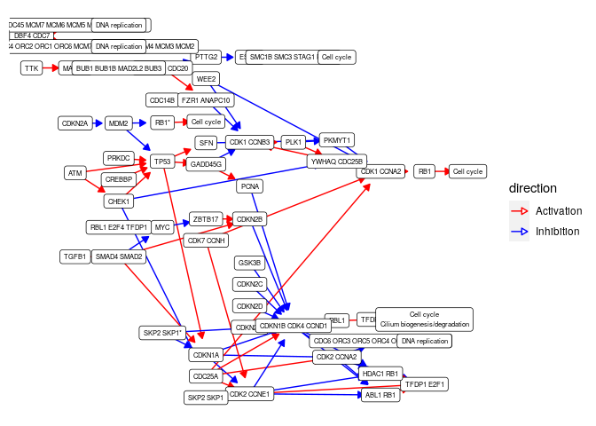
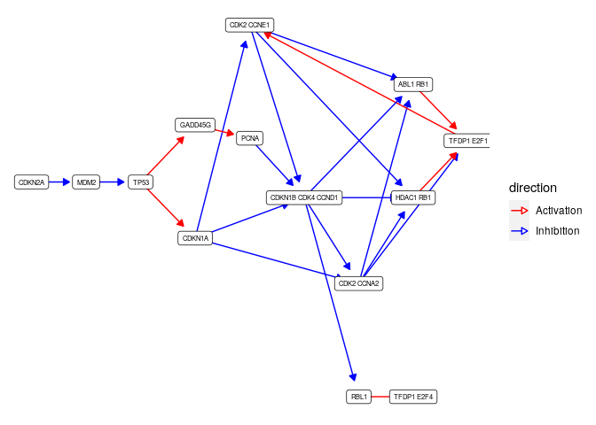
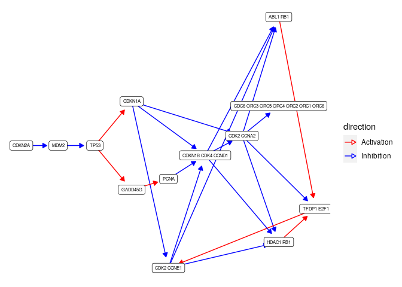
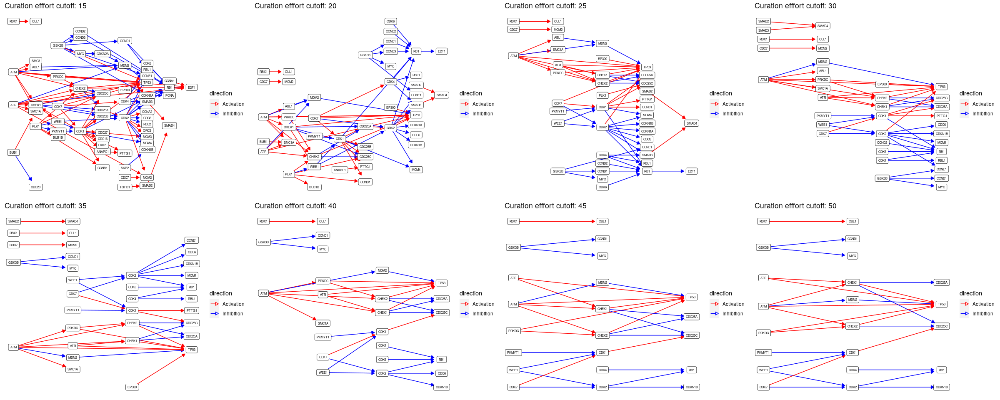

Omnipath to hipathia
================
Martin Garrido Rodriguez-Cordoba

## Abstract

The main goal of this parser is to transform an
[Omnipath](http://omnipathdb.org/) formatted set of interactions into an
object usable by the mechanistic modelling tool
[hipathia](http://hipathia.babelomics.org/). Hipathia uses a signal
propagation algorithm to estimate the activity of receptor-to-effector
signaling circuits. Its current version uses a pathway-centric approach
fed by a mixture of context-specific and generic signaling pathways as
defined by the [KEGG
classification](https://www.genome.jp/kegg/pathway.html). On the other
hand, Omnipath is a meta-resource that contains biological information
from different databases in a ready-to-use tabular format. It comprises
several types of relationships between biological entities as
protein-protein interactions or TF-target relationships, as well as gene
and protein functional annotations.

## Packages and functions

Load required packages

``` r
library(OmnipathR)
library(hipathia)
library(igraph)
library(dplyr)
library(ggplot2)
library(ggraph)
library(Rgraphviz)
library(cowplot)
library(org.Hs.eg.db)
library(purrr)
source("R/omnipath-to-hipathia.R")
source("R/visualize-hipathia-graph.R")
```

## Prepare Omnipath interactions

Import all Omnipath interactions with `import_Omnipath_Interactions()`,
which contains only interactions with references. Subset such
interactions to consensus activations or inhibitiosn and discard
auto-interactions. The **curation\_effort** attribute contains the the
number of unique resource+reference pairs per
interaction.

``` r
interactions <- OmnipathR::import_Omnipath_Interactions()
```

    ## Downloaded 36684 interactions

    ## removed 0 interactions during database filtering.

``` r
# filter only to directed interactions (consensus) and remove self interactions
intInteractions <- subset(interactions, 
                          (consensus_stimulation == 1 & consensus_inhibition == 0) | 
                            (consensus_stimulation == 0 & consensus_inhibition == 1)) %>%
  subset(source_genesymbol != target_genesymbol)
```

## Hipathia default

Hipathia uses a pathway-centric approach, which isolates nodes and
interactions in different biological contexts defined by KEGG. It
decomposes the signaling networks into a meta graph information object
(MGI), which contains the main graph, the decomposed signaling circuits
(in form of [igraph](https://igraph.org/) objects) and the neccesary
metadata to carry out the analysis. For this case of use, we will focus
on the [cell cycle
pathway](https://www.genome.jp/kegg-bin/show_pathway?hsa04110).

``` r
intPathways <- c("Cell Cycle"="hsa04110")
hipathiaMgi <- hipathia::load_pathways(species = "hsa", pathways_list = intPathways)
```

    ## snapshotDate(): 2020-04-27

    ## Loaded 1 pathways

This is the complete network already processed to be used by Hipathia

``` r
beautyHipathiaGraph(hipathiaMgi$pathigraphs$hsa04110$graph)
```

<!-- -->

And some of the decomposed
circuits…

``` r
lapply(hipathiaMgi$pathigraphs$hsa04110$subgraphs[1:3], beautyHipathiaGraph)
```

    ## $`P-hsa04110-1-46`

<!-- -->

    ## 
    ## $`P-hsa04110-1-96 97`

<!-- -->

    ## 
    ## $`P-hsa04110-1-60 10 11 12 13 14 9`

<!-- -->

## Hipathia nodes, Omnipath interactions

For a first try, we will employ the subset of nodes from the [cell cycle
pathway](https://www.genome.jp/kegg-bin/show_pathway?hsa04110), using
Omnipath interactions to link the nodes within a range of
curation\_effort values. The first step consists on obtaining the list
of genes (nodes) from hipathia:

``` r
intGenes <- V(hipathiaMgi$pathigraphs$hsa04110$graph)$genesList %>%
  unlist() %>%
  mapIds(x = org.Hs.eg.db, keys = ., keytype = "ENTREZID", column = "SYMBOL") %>%
  as.character() %>%
  .[!is.na(.)]
```

    ## 'select()' returned 1:1 mapping between keys and columns

Once with interesting genes (nodes), we can create a list of
interactions using a range of curation effort cutoffs.

``` r
curationValues <- c(15, 20, 25, 30, 35, 40, 45, 50)
interactionsList <- lapply(curationValues, function(cutoff) {
  selectedInteractions <- subset(intInteractions, curation_effort >= cutoff) %>%
    subset(source_genesymbol %in% intGenes & target_genesymbol %in% intGenes) 
})
names(interactionsList) <- curationValues
```

Once with the interactions filtered and prepared, we can apply the
**omnipathToHipathia** function to transform this networks into the
hipathia MGI object

``` r
mgiList <- lapply(interactionsList, omnipathToHipathia)
```

Finally, we can visualize the resulting graphs for the range of curation
effort
cutoffs…

``` r
purrr::imap(mgiList, function(x, y) beautyHipathiaGraph(x$pathigraphs$hsa00$graph) + ggtitle(paste0("Curation efffort cutoff: ", y))) %>%
  cowplot::plot_grid(plotlist = ., nrow = 2)
```

    ## Warning in .local(from, to, graph): edges replaced: 'N-hsa00-40|N-hsa00-29'

    ## Warning in .local(from, to, graph): edges replaced: 'N-hsa00-29|N-hsa00-39'

<!-- -->

## Note

**The creation of the MGI object takes a really long time on complex
graphs**, specially when there are lots of edges between nodes which are
not receptors nor effectors.

## Possible features

1.  Use the curation effort to create a range of results depending on
    the network reliability.

2.  Expand the effector nodes to new effecotrs, using Kinase-Substrate
    or TF-target interactions.

3.  Combine the functional annotation from different databases to create
    a list of context-specific pathways (such as KEGG, but without using
    only its interactions).

## Session info

``` r
sessionInfo()
```

    ## R version 4.0.0 (2020-04-24)
    ## Platform: x86_64-pc-linux-gnu (64-bit)
    ## Running under: Ubuntu 18.04.4 LTS
    ## 
    ## Matrix products: default
    ## BLAS:   /usr/lib/x86_64-linux-gnu/blas/libblas.so.3.7.1
    ## LAPACK: /usr/lib/x86_64-linux-gnu/lapack/liblapack.so.3.7.1
    ## 
    ## locale:
    ##  [1] LC_CTYPE=en_US.UTF-8       LC_NUMERIC=C              
    ##  [3] LC_TIME=es_ES.UTF-8        LC_COLLATE=en_US.UTF-8    
    ##  [5] LC_MONETARY=es_ES.UTF-8    LC_MESSAGES=en_US.UTF-8   
    ##  [7] LC_PAPER=es_ES.UTF-8       LC_NAME=C                 
    ##  [9] LC_ADDRESS=C               LC_TELEPHONE=C            
    ## [11] LC_MEASUREMENT=es_ES.UTF-8 LC_IDENTIFICATION=C       
    ## 
    ## attached base packages:
    ##  [1] grid      stats4    parallel  stats     graphics  grDevices utils    
    ##  [8] datasets  methods   base     
    ## 
    ## other attached packages:
    ##  [1] purrr_0.3.4                 org.Hs.eg.db_3.11.0        
    ##  [3] AnnotationDbi_1.50.0        cowplot_1.0.0              
    ##  [5] Rgraphviz_2.32.0            graph_1.66.0               
    ##  [7] ggraph_2.0.2                ggplot2_3.3.0              
    ##  [9] dplyr_0.8.5                 hipathia_2.4.0             
    ## [11] MultiAssayExperiment_1.14.0 SummarizedExperiment_1.18.1
    ## [13] DelayedArray_0.14.0         matrixStats_0.56.0         
    ## [15] Biobase_2.48.0              GenomicRanges_1.40.0       
    ## [17] GenomeInfoDb_1.24.0         IRanges_2.22.1             
    ## [19] S4Vectors_0.26.0            AnnotationHub_2.20.0       
    ## [21] BiocFileCache_1.12.0        dbplyr_1.4.3               
    ## [23] BiocGenerics_0.34.0         OmnipathR_1.2.0            
    ## [25] igraph_1.2.5               
    ## 
    ## loaded via a namespace (and not attached):
    ##  [1] bitops_1.0-6                  bit64_0.9-7                  
    ##  [3] httr_1.4.1                    tools_4.0.0                  
    ##  [5] R6_2.4.1                      DBI_1.1.0                    
    ##  [7] colorspace_1.4-1              withr_2.2.0                  
    ##  [9] tidyselect_1.0.0              gridExtra_2.3                
    ## [11] bit_1.1-15.2                  curl_4.3                     
    ## [13] compiler_4.0.0                preprocessCore_1.50.0        
    ## [15] labeling_0.3                  scales_1.1.0                 
    ## [17] rappdirs_0.3.1                stringr_1.4.0                
    ## [19] digest_0.6.25                 rmarkdown_2.1                
    ## [21] XVector_0.28.0                pkgconfig_2.0.3              
    ## [23] htmltools_0.4.0               fastmap_1.0.1                
    ## [25] rlang_0.4.6                   RSQLite_2.2.0                
    ## [27] shiny_1.4.0.2                 farver_2.0.3                 
    ## [29] jsonlite_1.6.1                RCurl_1.98-1.2               
    ## [31] magrittr_1.5                  GenomeInfoDbData_1.2.3       
    ## [33] Matrix_1.2-18                 Rcpp_1.0.4.6                 
    ## [35] munsell_0.5.0                 viridis_0.5.1                
    ## [37] lifecycle_0.2.0               stringi_1.4.6                
    ## [39] yaml_2.2.1                    MASS_7.3-51.6                
    ## [41] zlibbioc_1.34.0               blob_1.2.1                   
    ## [43] promises_1.1.0                ggrepel_0.8.2                
    ## [45] crayon_1.3.4                  lattice_0.20-41              
    ## [47] graphlayouts_0.7.0            knitr_1.28                   
    ## [49] pillar_1.4.4                  servr_0.16                   
    ## [51] glue_1.4.0                    BiocVersion_3.11.1           
    ## [53] evaluate_0.14                 BiocManager_1.30.10          
    ## [55] vctrs_0.2.4                   tweenr_1.0.1                 
    ## [57] httpuv_1.5.2                  gtable_0.3.0                 
    ## [59] polyclip_1.10-0               tidyr_1.0.2                  
    ## [61] assertthat_0.2.1              xfun_0.13                    
    ## [63] ggforce_0.3.1                 mime_0.9                     
    ## [65] xtable_1.8-4                  tidygraph_1.1.2              
    ## [67] later_1.0.0                   viridisLite_0.3.0            
    ## [69] tibble_3.0.1                  memoise_1.1.0                
    ## [71] ellipsis_0.3.0                interactiveDisplayBase_1.26.0
