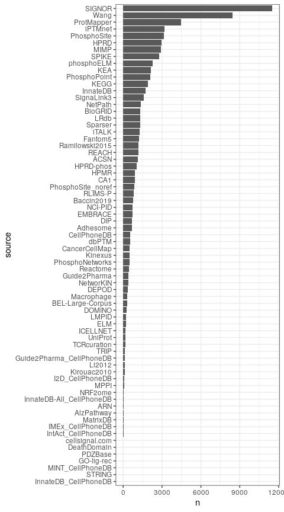

Omnipath to hipathia
================
Martin Garrido Rodriguez-Cordoba
2020-05-25

## Abstract

The main goal of this parser is to transform an
[Omnipath](http://omnipathdb.org/) formatted set of interactions into an
object usable by the mechanistic modelling tool
[hipathia](http://hipathia.babelomics.org/). Hipathia uses a signal
propagation algorithm to estimate the activity of receptor-to-effector
signaling circuits. Its current version uses a pathway-centric approach
fed by a mixture of context-specific and generic signaling pathways as
defined by the [KEGG
classification](https://www.genome.jp/kegg/pathway.html). On the other
hand, Omnipath is a meta-resource that contains biological information
from different databases in a ready-to-use tabular format. It comprises
several types of relationships between biological entities as
protein-protein interactions or TF-target relationships, as well as gene
and protein functional annotations.

## Packages and functions

Load required packages

``` r
# main packages
library(OmnipathR)
library(hipathia)
# annotation package to translate symbols into entrezs
library(org.Hs.eg.db)
# packages to handle and plot graphs
library(igraph)
library(ggplot2)
library(ggraph)
library(Rgraphviz)
library(cowplot)
library(ggforce)
# other packages from tidyverse
library(dplyr)
library(purrr)
# package to create pretty heatmap
library(ComplexHeatmap)
# custom parsing and plotting funs
source("R/omnipath-to-hipathia.R")
source("R/visualize-hipathia-graph.R")
# set ggplot default theme
theme_set(theme_bw() + theme(plot.title = element_text(hjust = 0.5)))
```

## Prepare Omnipath interactions

Import all Omnipath interactions with `import_Omnipath_Interactions()`,
which contains only interactions with references. Subset such
interactions to consensus activations or inhibitiosn and discard
auto-interactions. The **curation\_effort** attribute contains the the
number of unique resource+reference pairs per
interaction.

``` r
interactions <- OmnipathR::import_Omnipath_Interactions()
```

    ## Downloaded 36684 interactions

    ## removed 0 interactions during database filtering.

``` r
# filter only to directed interactions (consensus) and remove self interactions
intInteractions <- subset(interactions, 
                          (consensus_stimulation == 1 & consensus_inhibition == 0) | 
                            (consensus_stimulation == 0 & consensus_inhibition == 1)) %>%
  subset(source_genesymbol != target_genesymbol)
```

Explore number of interactions per curation\_effort
level

``` r
# as the majority of interactions occur in the low range of curation efforts, zoom this zone
ggplot(intInteractions, aes(x = curation_effort)) +
  geom_histogram(binwidth = 1) +
  ggforce::facet_zoom(x = curation_effort %in% seq(-1,25, by = 1)) +
  ggtitle("Interactions by curation effort")
```

<!-- -->

## Hipathia default MGI

Hipathia uses a pathway-centric approach, which isolates nodes and
interactions in different biological contexts defined by KEGG. It
decomposes the signaling networks into a meta graph information object
(MGI), which contains the main graph, the decomposed signaling circuits
(in form of [igraph](https://igraph.org/) objects) and the neccesary
metadata to carry out the analysis. For this case of use, we will focus
on the [cell cycle
pathway](https://www.genome.jp/kegg-bin/show_pathway?hsa04110).

``` r
intPathways <- c("Cell Cycle"="hsa04110")
hipathiaMgi <- hipathia::load_pathways(species = "hsa", pathways_list = intPathways)
```

    ## snapshotDate(): 2020-04-27

    ## Loaded 1 pathways

This is the complete network already processed to be used by Hipathia

``` r
beautyHipathiaGraph(hipathiaMgi$pathigraphs$hsa04110$graph)
```

<!-- -->

Some of the decomposed subgraphs (all receptors that reach one
effector)…

``` r
lapply(hipathiaMgi$pathigraphs$hsa04110$effector.subgraphs[1:2], beautyHipathiaGraph)
```

    ## $`P-hsa04110-46`

<!-- -->

    ## 
    ## $`P-hsa04110-96 97`

<!-- -->

And some of the decomposed effector circuits (one receptor to one
effector)…

``` r
lapply(hipathiaMgi$pathigraphs$hsa04110$subgraphs[1:2], beautyHipathiaGraph)
```

    ## $`P-hsa04110-1-46`

<!-- -->

    ## 
    ## $`P-hsa04110-1-96 97`

<!-- -->

## Hipathia nodes, Omnipath interactions

For a first try, we will employ the subset of nodes from the [cell cycle
pathway](https://www.genome.jp/kegg-bin/show_pathway?hsa04110), using
Omnipath interactions to link the nodes within a range of
curation\_effort values. The first step consists on obtaining the list
of genes (nodes) from hipathia:

``` r
intGenes <- V(hipathiaMgi$pathigraphs$hsa04110$graph)$genesList %>%
  unlist() %>%
  mapIds(x = org.Hs.eg.db, keys = ., keytype = "ENTREZID", column = "SYMBOL") %>%
  as.character() %>%
  .[!is.na(.)]
```

    ## 'select()' returned 1:1 mapping between keys and columns

And subset the Omnipath interactions to those which contain a relation
between genes in the pathway **including complexes**.

``` r
sourceIndex <- strsplit(intInteractions$source_genesymbol, "_") %>% 
  sapply(function(x) any(x %in% intGenes))
targetIndex <- strsplit(intInteractions$target_genesymbol, "_") %>% 
  sapply(function(x) any(x %in% intGenes))
# filter to interactions fulfilling the criteria
filteredInteractions <- intInteractions[sourceIndex & targetIndex, ]
```

Once with interesting genes (nodes), we can create a list of
interactions using a range of curation effort cutoffs.

``` r
curationValues <- c(15, 25, 35, 45, 55)
interactionsList <- lapply(curationValues, function(cutoff) {
  selectedInteractions <- subset(filteredInteractions, curation_effort >= cutoff)
})
names(interactionsList) <- curationValues
```

Once with the interactions filtered and prepared, we can apply the
**omnipathToHipathia()** function to transform this networks into the
hipathia MGI object. This function relies on the hipathia function
**mgi\_from\_sif()**, which creates the MGI object from the sif and
attribute files. The **omnipathToHipathia()** will format the network
and write the files into a temporary location in order to be imported
with hipathia.

``` r
mgiList <- purrr::imap(interactionsList, function(interactions, cutoff){
  t1 <- Sys.time()
  mgi <- omnipathToHipathia(omnipathInteractions = interactions)
  t2 <- Sys.time()
  print(paste0("Curation effort cutoff: ", cutoff))
  print(t2 - t1)
  return(mgi)
})
```

    ## [1] "Curation effort cutoff: 15"
    ## Time difference of 3.265801 secs
    ## [1] "Curation effort cutoff: 25"
    ## Time difference of 0.5933142 secs
    ## [1] "Curation effort cutoff: 35"
    ## Time difference of 0.4850829 secs
    ## [1] "Curation effort cutoff: 45"
    ## Time difference of 0.3810277 secs
    ## [1] "Curation effort cutoff: 55"
    ## Time difference of 0.3708439 secs

Finally, we can visualize the resulting MGI graphs for the range of
curation effort
cutoffs…

``` r
purrr::imap(mgiList, function(x, y) beautyHipathiaGraph(x$pathigraphs$hsa00$graph) + ggtitle(paste0("Curation efffort cutoff: ", y))) %>%
  cowplot::plot_grid(plotlist = ., nrow = 2)
```

    ## Warning in .local(from, to, graph): edges replaced: 'N-hsa00-40|N-hsa00-29'

    ## Warning in .local(from, to, graph): edges replaced: 'N-hsa00-29|N-hsa00-39'

<!-- -->

## Hipathia run with BRCA data and Omnipath MGIs

From the [hipathia
vignette](https://www.bioconductor.org/packages/release/bioc/vignettes/hipathia/inst/doc/hipathia-vignette.pdf):

“In order to illustrate the hipathia package functionalities an example
dataset has been prepared. Data has been downloaded from The Cancer
Genome Atlas data repository, from the BRCA-US project, release 20. 20
tumor and 20 normal samples of RNA-Seq data have been randomly selected
and normalized. Specifically, raw data has been corrected for batch
effect using the ComBat function from package sva, then corrected for
RNA composition bias applying TMM normalization from package edgeR, and
finally log-transformed.”

“The dataset brca is a SummarizedExperiment object, including the gene
expression of the 40 samples in the assay raw, and the information about
whether each sample comes from Tumor or Normal tissues in the group
columns of the colData dataFrame.”

``` r
# prepare data for hipathia
data("brca")
toHipahia <- translate_data(brca_data, "hsa") %>%
  normalize_data(., by_quantiles = TRUE)
```

    ## snapshotDate(): 2020-04-27

    ## translated ids = 3184 (1) 
    ## untranslated ids = 3 (0.00094) 
    ## multihit ids = 0 (0)

``` r
# add default hipathia pathway to analysis
defaultMgi <- list("default" = hipathiaMgi)
mgiList <- c(defaultMgi, mgiList)
# iterative analysis with all MGIs, extracting path values after hipathia analysis
pathValList <- lapply(mgiList, function(x) {
  # perform hipathia analysis
  pathVals <- hipathia::hipathia(toHipahia, metaginfo = x) %>%
    get_paths_data(matrix = TRUE)
  # get path names
  rownames(pathVals) <- hipathia::get_path_names(metaginfo = x, names = rownames(pathVals))
  # center path values
  pathVals <- t(scale(t(pathVals))) 
  return(pathVals)
})
```

    ## Added missing genes: 6 (0.19%)

    ## HiPathia processing...
    ## hsa04110 - Cell cycle

    ## Added missing genes: 2 (0.06%)

    ## HiPathia processing...
    ## hsa00 - Omnipath 
    ## HiPathia processing...
    ## hsa00 - Omnipath 
    ## HiPathia processing...
    ## hsa00 - Omnipath 
    ## HiPathia processing...
    ## hsa00 - Omnipath 
    ## HiPathia processing...
    ## hsa00 - Omnipath

Plot a global heatmap to visualize path values by MGI

``` r
# prepare matrix to plot
toHm <- Reduce(rbind, pathValList) %>%
  t()
# remove non informative column names
colnames(toHm) <- gsub("Omnipath:.|Cell cycle:.", "", colnames(toHm))
# create group annotation
set.seed(109)
rightAnn <- ComplexHeatmap::rowAnnotation(df = brca_design)
# create column split and annotation
cutoff <- rep(names(pathValList), sapply(pathValList, nrow)) %>%
  factor(x = ., levels = unique(.))
colAnn <- ComplexHeatmap::HeatmapAnnotation(df = data.frame(cutoff = cutoff))
# plot heatmap without column clustering
Heatmap(toHm, 
        right_annotation = rightAnn,
        column_split = cutoff,
        cluster_column_slices = FALSE,
        show_row_names = FALSE,
        border = TRUE,
        row_title = "Patients")
```

<!-- -->

``` r
# plot heatmap with column clustering
Heatmap(toHm, 
        right_annotation = rightAnn,
        top_annotation = colAnn,
        show_row_names = FALSE,
        border = TRUE,
        row_title = "Patients")
```

<!-- -->

## Note

**The creation of the MGI object takes a really long time on complex
graphs**, specially when there are lots of edges between nodes which are
not receptors nor effectors.

## Possible features

1.  Use the curation effort to create a range of results depending on
    the network reliability.

2.  Expand the effector nodes to new effectors, using Kinase-Substrate
    or TF-target interactions.

3.  Create a meta graph without filtering nodes by biological context.

## Session info

``` r
sessionInfo()
```

    ## R version 4.0.0 (2020-04-24)
    ## Platform: x86_64-pc-linux-gnu (64-bit)
    ## Running under: Ubuntu 18.04.4 LTS
    ## 
    ## Matrix products: default
    ## BLAS:   /usr/lib/x86_64-linux-gnu/blas/libblas.so.3.7.1
    ## LAPACK: /usr/lib/x86_64-linux-gnu/lapack/liblapack.so.3.7.1
    ## 
    ## locale:
    ##  [1] LC_CTYPE=en_US.UTF-8       LC_NUMERIC=C              
    ##  [3] LC_TIME=es_ES.UTF-8        LC_COLLATE=en_US.UTF-8    
    ##  [5] LC_MONETARY=es_ES.UTF-8    LC_MESSAGES=en_US.UTF-8   
    ##  [7] LC_PAPER=es_ES.UTF-8       LC_NAME=C                 
    ##  [9] LC_ADDRESS=C               LC_TELEPHONE=C            
    ## [11] LC_MEASUREMENT=es_ES.UTF-8 LC_IDENTIFICATION=C       
    ## 
    ## attached base packages:
    ##  [1] grid      stats4    parallel  stats     graphics  grDevices utils    
    ##  [8] datasets  methods   base     
    ## 
    ## other attached packages:
    ##  [1] ComplexHeatmap_2.5.3        purrr_0.3.4                
    ##  [3] dplyr_0.8.5                 ggforce_0.3.1              
    ##  [5] cowplot_1.0.0               Rgraphviz_2.32.0           
    ##  [7] graph_1.66.0                ggraph_2.0.2               
    ##  [9] ggplot2_3.3.0               org.Hs.eg.db_3.11.0        
    ## [11] AnnotationDbi_1.50.0        hipathia_2.4.0             
    ## [13] MultiAssayExperiment_1.14.0 SummarizedExperiment_1.18.1
    ## [15] DelayedArray_0.14.0         matrixStats_0.56.0         
    ## [17] Biobase_2.48.0              GenomicRanges_1.40.0       
    ## [19] GenomeInfoDb_1.24.0         IRanges_2.22.1             
    ## [21] S4Vectors_0.26.0            AnnotationHub_2.20.0       
    ## [23] BiocFileCache_1.12.0        dbplyr_1.4.3               
    ## [25] BiocGenerics_0.34.0         OmnipathR_1.2.0            
    ## [27] igraph_1.2.5               
    ## 
    ## loaded via a namespace (and not attached):
    ##  [1] bitops_1.0-6                  bit64_0.9-7                  
    ##  [3] RColorBrewer_1.1-2            httr_1.4.1                   
    ##  [5] tools_4.0.0                   R6_2.4.1                     
    ##  [7] DBI_1.1.0                     colorspace_1.4-1             
    ##  [9] GetoptLong_0.1.8              withr_2.2.0                  
    ## [11] tidyselect_1.0.0              gridExtra_2.3                
    ## [13] bit_1.1-15.2                  curl_4.3                     
    ## [15] compiler_4.0.0                preprocessCore_1.50.0        
    ## [17] labeling_0.3                  scales_1.1.0                 
    ## [19] rappdirs_0.3.1                stringr_1.4.0                
    ## [21] digest_0.6.25                 rmarkdown_2.1                
    ## [23] XVector_0.28.0                pkgconfig_2.0.3              
    ## [25] htmltools_0.4.0               fastmap_1.0.1                
    ## [27] GlobalOptions_0.1.1           rlang_0.4.6                  
    ## [29] RSQLite_2.2.0                 shiny_1.4.0.2                
    ## [31] shape_1.4.4                   farver_2.0.3                 
    ## [33] jsonlite_1.6.1                RCurl_1.98-1.2               
    ## [35] magrittr_1.5                  GenomeInfoDbData_1.2.3       
    ## [37] Matrix_1.2-18                 Rcpp_1.0.4.6                 
    ## [39] munsell_0.5.0                 viridis_0.5.1                
    ## [41] lifecycle_0.2.0               stringi_1.4.6                
    ## [43] yaml_2.2.1                    MASS_7.3-51.6                
    ## [45] zlibbioc_1.34.0               blob_1.2.1                   
    ## [47] promises_1.1.0                ggrepel_0.8.2                
    ## [49] crayon_1.3.4                  lattice_0.20-41              
    ## [51] graphlayouts_0.7.0            circlize_0.4.9               
    ## [53] knitr_1.28                    pillar_1.4.4                 
    ## [55] rjson_0.2.20                  servr_0.16                   
    ## [57] glue_1.4.0                    BiocVersion_3.11.1           
    ## [59] evaluate_0.14                 BiocManager_1.30.10          
    ## [61] png_0.1-7                     vctrs_0.2.4                  
    ## [63] tweenr_1.0.1                  httpuv_1.5.2                 
    ## [65] gtable_0.3.0                  polyclip_1.10-0              
    ## [67] tidyr_1.0.2                   clue_0.3-57                  
    ## [69] assertthat_0.2.1              xfun_0.13                    
    ## [71] mime_0.9                      xtable_1.8-4                 
    ## [73] tidygraph_1.1.2               later_1.0.0                  
    ## [75] viridisLite_0.3.0             tibble_3.0.1                 
    ## [77] memoise_1.1.0                 cluster_2.1.0                
    ## [79] ellipsis_0.3.0                interactiveDisplayBase_1.26.0
